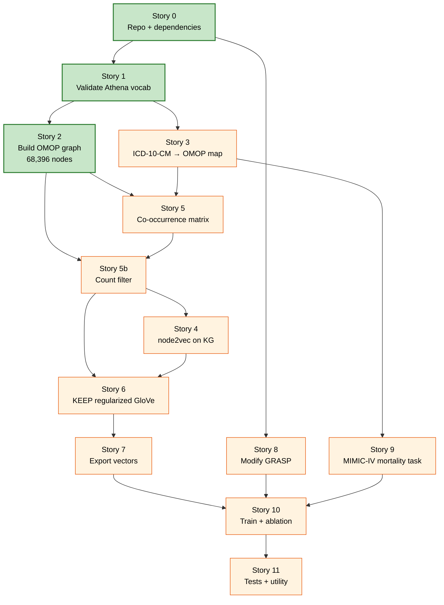

# keep-mimic4

Reproduction of **KEEP: Knowledge-preserving and Empirically refined Embedding Process** (Elhussein et al., CHIL 2025) on MIMIC-IV. Course project for **CS 598 Deep Learning for Healthcare** at UIUC, Spring 2026.

- Paper: <https://arxiv.org/abs/2510.05049>
- Reference implementation: <https://github.com/G2Lab/keep>

The end goal is to plug KEEP-trained medical-code embeddings into a GRASP+GRU in-hospital mortality model in PyHealth 2.0 and compare against the model's default learned embeddings.

> **🌐 Live visualization:** **[ddhangdd.github.io/keep-mimic4/keep_pipeline/viz/](https://ddhangdd.github.io/keep-mimic4/keep_pipeline/viz/)** — an interactive walk through the 68,396-node OMOP knowledge graph and the seven primary orphans the build script had to rescue. Cytoscape.js force-directed sample, depth distribution, and detailed case studies for each orphan.

## Status

| Story | Description | Status |
|---|---|---|
| 0 | Repo setup + dependency check | ✅ done |
| 1 | Athena vocabulary validation | ✅ done (re-confirmed in Story 0) |
| 2 | Build OMOP knowledge graph | ✅ done — 68,396 nodes / 152,347 edges |
| 3 | ICD-10-CM → OMOP mapping | ⏳ pending |
| 4 | Train node2vec on KG | ⏳ pending (blocked by Story 5b) |
| 5 | Co-occurrence matrix from MIMIC-IV | ⏳ pending |
| 5b | Count filter on patient-data-relevant concepts | ⏳ pending |
| 6 | Train regularized GloVe (KEEP) | ⏳ pending |
| 7 | Export KEEP vectors to PyHealth format | ⏳ pending |
| 8 | Modify GRASP to accept pretrained embeddings | ⏳ pending |
| 9 | MIMIC-IV mortality task setup | ⏳ pending |
| 10 | Train + ablation comparison | ⏳ pending |
| 11 | Tests + utility | ⏳ pending |

### Story dependency graph



See [`keep_implementation_plan.md`](keep_implementation_plan.md) for the full spec, paper-citation table, and acceptance criteria for each story.

## Repo structure

```
keep-mimic4/
├── README.md                       ← you are here
├── keep_implementation_plan.md     ← full spec for Stories 0–11
├── .gitignore
└── keep_pipeline/
    └── scripts/
        └── build_omop_graph.py     ← Story 2 (DuckDB → NetworkX → pickles)
```

The following are deliberately **not in the repo** (`.gitignore`d) and need to be set up locally before running anything:

| Path | What it is | How to get it |
|---|---|---|
| `PyHealth/` | PyHealth fork on `dev/grasp-full-pipeline` | `git clone --branch dev/grasp-full-pipeline https://github.com/lookman-olowo/PyHealth.git` |
| `PyHealth/.venv/` | Project venv with torch+CUDA, pyhealth, KEEP deps | See Story 0 in the spec |
| `keep_reference/` | KEEP author repo (read-only, used for copy-paste in Stories 4 + 6) | `git clone https://github.com/G2Lab/keep.git keep_reference` |
| `data/` | Athena OMOP vocabulary CSVs (~800 MB, license-restricted) | Download from <https://athena.ohdsi.org/> (requires free account) |
| `keep_pipeline/data/`, `keep_pipeline/embeddings/` | Built graph, index mappings, embeddings | Regenerated by the scripts |

## Pipeline architecture

How data flows from raw Athena vocabularies + MIMIC-IV diagnoses through the KEEP two-stage embedding process and into the downstream GRASP+GRU mortality model. Cylinders are external data sources, rectangles are scripts in `keep_pipeline/scripts/`, and parallelograms are intermediate file artifacts.

```mermaid
flowchart LR
    Athena[("Athena<br/>vocabularies")]
    MIMIC[("MIMIC-IV<br/>diagnoses_icd")]

    Athena -->|Story 2| BG["build_omop_graph.py"]
    BG --> Graph[/"omop_graph.pkl<br/>concept_to_idx.pkl"/]

    Athena -->|Story 3| BM["build_icd_to_omop_mapping.py"]
    BM --> Map[/"icd_to_omop.pkl"/]

    Graph --> BC
    Map --> BC
    MIMIC -->|Story 5| BC["build_cooccurrence_matrix.py"]
    BC --> CMat[/"cooc_matrix.npz"/]

    Graph --> AF
    CMat -->|Story 5b| AF["apply_count_filter.py"]
    AF --> GF[/"omop_graph_filtered.pkl<br/>cooc_filtered.npz"/]

    GF -->|Story 4| TN["train_node2vec.py"]
    TN --> NEmb[/"node2vec_embeddings.npy"/]

    NEmb --> TG
    GF -->|Story 6| TG["train_keep_glove.py"]
    TG --> KEmb[/"keep_embeddings.pkl"/]

    KEmb -->|Story 7| EX["export_keep_vectors.py"]
    EX --> Txt[/"keep_vectors.txt"/]

    Txt --> Eval
    Map --> Eval
    MIMIC -->|Stories 8 + 9 + 10| Eval["GRASP+GRU mortality model<br/>train + ablation"]

    style Athena fill:#e1f5fe,stroke:#01579b
    style MIMIC fill:#e1f5fe,stroke:#01579b
    style BG fill:#c8e6c9,stroke:#2e7d32,stroke-width:2px
    style Graph fill:#c8e6c9,stroke:#2e7d32
    style BM fill:#fff3e0,stroke:#e65100
    style BC fill:#fff3e0,stroke:#e65100
    style AF fill:#fff3e0,stroke:#e65100
    style TN fill:#fff3e0,stroke:#e65100
    style TG fill:#fff3e0,stroke:#e65100
    style EX fill:#fff3e0,stroke:#e65100
    style Eval fill:#fff3e0,stroke:#e65100
```



Green = built, orange = TBD. The "two-stage" KEEP design from the paper is the `train_node2vec.py` → `train_keep_glove.py` chain on the right side: node2vec generates an initial embedding from the knowledge graph alone, then regularized GloVe refines it on the empirical co-occurrence matrix while staying close to the node2vec init via an L2 regularization term (paper Equation 4, p. 5).

> 🔍 **See the actual graph:** the [live visualization page](https://ddhangdd.github.io/keep-mimic4/keep_pipeline/viz/) renders a sampled slice of the real `omop_graph.pkl` in your browser, plus detailed case studies of all 7 primary orphans from the rescue patch.

## Quick start (reproducing Stories 0 + 2)

1. **Follow Story 0** in [`keep_implementation_plan.md`](keep_implementation_plan.md) to clone PyHealth, create the venv, install torch+CUDA + the KEEP-pipeline packages, clone the KEEP reference repo, and download the Athena CSVs to `data/`.

2. **Build the OMOP knowledge graph (Story 2):**
   ```bash
   PyHealth/.venv/bin/python keep_pipeline/scripts/build_omop_graph.py
   ```
   Expected output:
   - `keep_pipeline/data/omop_graph.pkl` (~4.2 MB) — `networkx.DiGraph`, parent → child
   - `keep_pipeline/data/concept_to_idx.pkl` (~0.55 MB)
   - `keep_pipeline/data/idx_to_concept.pkl` (~0.55 MB)
   - Console: `nodes: 68,396 / edges: 152,347 / leaves: 41,780 / multi-parent: 46,841`

## Notes for re-implementers

A few things that surprised us during reproduction and aren't obvious from the paper or the reference repo:

- **Story 2 orphan rescue.** Naively building the graph as "standard SNOMED Condition descendants of `4274025` (Disease) within depth ≤5, edges = `min_levels_of_separation = 1`" leaves **42 nodes unreachable from the root** (7 primary orphans + 35 downstream). Cause: some Condition concepts have their direct SNOMED parent in the **Observation** domain (e.g. `4234597` "Misuses drugs" → `4042889` "Finding relating to drug misuse behavior"), so the parent is filtered out and the child loses its only incoming edge. `build_omop_graph.py` step 3a patches this with transitive ancestor edges. The paper §A.1.1 doesn't mention this.

- **Story 6 — three reference-vs-paper deviations.** The G2Lab reference `train_glove.py` differs from the KEEP paper in three places, all confirmed by reading the paper PDF:
  - `LAMBD = 1e-5` (line 56) — paper Table 6 (p. 16) says **`λ = 1×10⁻³`**
  - `torch.optim.Adagrad` (line 188) — paper Algorithm 1 (p. 14) says **AdamW**
  - Default `REG_NORM = None` (line 46), which routes `Glove.forward` through the `1 - cosine_similarity` branch at lines 161-163 — paper Equation 4 (p. 5) says **squared L2 norm**. Pass `reg_norm=2` to take the L2 branch at lines 165-166 instead.

  When implementing Story 6, follow the paper, not the reference repo. (Verified by us against `KEEP paper.pdf` arxiv:2510.05049v1.)

- **Reference-code gotcha — duplicate `get_vector_iso`.** `keep_reference/trained_embeddings/our_embeddings/train_node2vec.py` defines `get_vector_iso()` **twice** — first at line 69 (a stale 2-arg signature) and again at line 85 (the working version with the mean-vector fallback). The second shadows the first; copy the line-85 version when adapting Story 4.

- **`node2vec 0.5.0` numpy quirk.** Its install metadata declares `numpy<2.0.0`, but it actually works with `numpy 2.2.6` (which PyHealth needs). pip prints a resolver-conflict warning at install time; ignore it. **Do not downgrade numpy** — that would break PyHealth.

## Citation

If you use any of this work, please cite the original KEEP paper:

```bibtex
@inproceedings{elhussein2025keep,
  title={KEEP: Integrating Medical Ontologies with Clinical Data for Robust Code Embeddings},
  author={Elhussein, Ahmed and Meddeb, Paul and Newbury, Abigail and Mirone, Jeanne and Stoll, Martin and G\"ursoy, Gamze},
  booktitle={Proceedings of Machine Learning Research},
  volume={287},
  pages={1--19},
  year={2025},
  note={Conference on Health, Inference, and Learning (CHIL) 2025}
}
```
